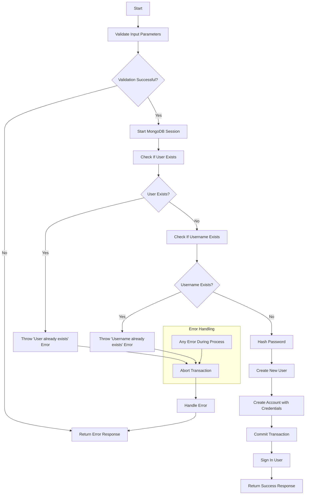
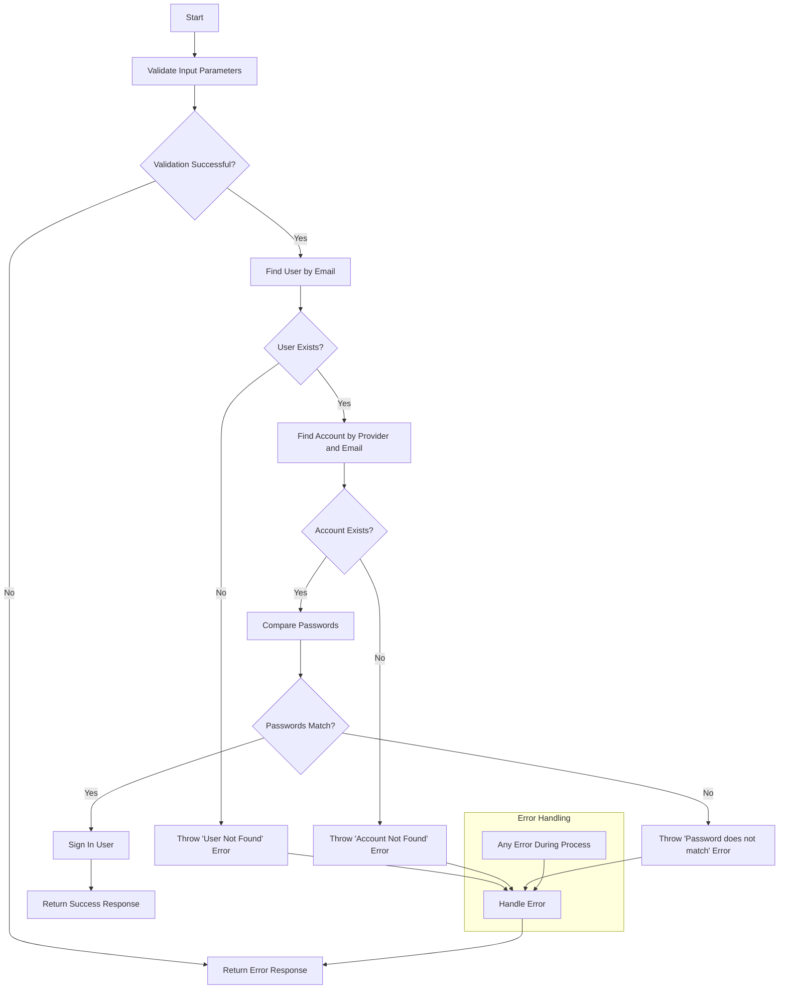

# Authentication Flows

## Sign Up With Credentials Flow

```mermaid
graph TD
    A[Start] --> B[Validate Input Parameters]
    B --> C{Validation Successful?}
    C -->|No| D[Return Error Response]
    C -->|Yes| E[Start MongoDB Session]
    E --> F[Check If User Exists]
    F --> G{User Exists?}
    G -->|Yes| H[Throw 'User already exists' Error]
    G -->|No| I[Check If Username Exists]
    I --> J{Username Exists?}
    J -->|Yes| K[Throw 'Username already exists' Error]
    J -->|No| L[Hash Password]
    L --> M[Create New User]
    M --> N[Create Account with Credentials]
    N --> O[Commit Transaction]
    O --> P[Sign In User]
    P --> Q[Return Success Response]

    H --> R[Abort Transaction]
    K --> R
    R --> S[Handle Error]
    S --> D

    subgraph Error Handling
        T[Any Error During Process] --> R
    end
```

## Sign In With Credentials Flow

```mermaid
graph TD
    A[Start] --> B[Validate Input Parameters]
    B --> C{Validation Successful?}
    C -->|No| D[Return Error Response]
    C -->|Yes| E[Find User by Email]
    E --> F{User Exists?}
    F -->|No| G[Throw 'User Not Found' Error]
    F -->|Yes| H[Find Account by Provider and Email]
    H --> I{Account Exists?}
    I -->|No| J[Throw 'Account Not Found' Error]
    I -->|Yes| K[Compare Passwords]
    K --> L{Passwords Match?}
    L -->|No| M[Throw 'Password does not match' Error]
    L -->|Yes| N[Sign In User]
    N --> O[Return Success Response]

    G --> P[Handle Error]
    J --> P
    M --> P
    P --> D

    subgraph Error Handling
        Q[Any Error During Process] --> P
    end
```
